An important part of your project is your R Markdown process notebook. Your notebook details all your steps in developing your solution, including how you collected the data, alternative solutions you tried, describing machine learning algorithms/techniques you used, and the insights you got. It is strongly recommended to include many visualizations. Your process notebook should include the following topics:

Overview and motivation: overview of the project goals and the motivation for it
Related work: anything related, such as a paper, a website, a newspaper article or something else
Initial questions:
What questions are you trying to answer?
How did these questions evolve over the course of the project?
What new questions did you consider in the course of your analysis?
Data: source, scraping method, cleanup, storage, etc.
Exploratory data analysis:
What visualizations did you use to look at your data in different ways?
What are the different machine learning methods you considered?
Justify the decisions you made, and show any major changes to your ideas.
How did you reach these conclusions?
Final analysis:
What did you learn about the data?
How did you answer the questions?
How can you justify your answers?
Make sure that your process notebook is a standalone document that fully describes your process and results

# 1. Introduction

## 1.1 Overview
This markdown document is the result of the semester project of the course Data Science with R held in the winter semester 2018/2019 at the computer science faculty at the Otto-von-Guericke University Magdeburg by M.Sc. Uli Niemann from the KMD Lab. Further details regarding the lecture can be found on the official course website. This project was done as a team consisting of the members Johannes Dambacher and Alexander Wagner. The general project idea as well as a detailed time plan can be found in the project proposal. The basic idea of the course was to choose a dataset and to gain new insights using the language R. We have decided to use a dataset from the Universitätsklinik für Psychiatrie, Psychotherapie und Psychosomatische Medizin des Kindes- und Jugendalters (KKJP) at the medical faculty of the University of Magdeburg. Further information regarding the process of how the dataset was generated can be found in the dataset section. For an interactive visualization please see our Shiny website (https://ajwgnr.shinyapps.io/miner/). The whole code for this project is stored in a public GitLab Repository.

## 1.2 Repository
GitLab Repository: https://gitlab.com/vornamenachname/datascience_r.git

## 1.3 Background and motivation
The data was recorded during a study on the impact of exploring novelty onto the learning success of children. The study group consisted of children having different types of ADHD and a control group.
For the experiment, both groups (with ADHD and the control group) had to attend the study on three different days.
On the first day, the test persons got familiarized with the virtual world by spending between 10 and 20 minutes exploring one of the two worlds (see one of the worlds in the image below).
On the second day, the test persons had to learn 20 new vocabularies and recall them afterward. After the recalling, the test persons had again the task to explore a virtual world for 10 to 20 minutes. The virtual world on day one and day two were the same for some test persons and different for others. On day three the vocabularies had to be recalled again by the test persons (see the process overview in the image below). Further test persons will perform the experiment in the future and thus enlarge the data set successively.
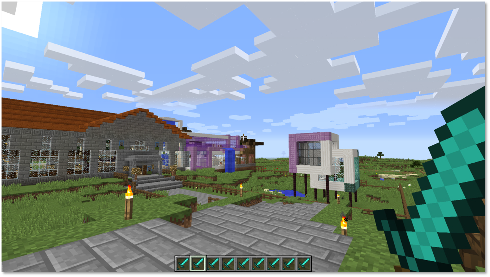

## 1.4 Dataset
The overall recorded data set consists of the trajectory data of 66 test persons in the virtual world as well as several other variables such as sex, age, and others. The data set is divided into trajectory data and information of the test persons in separate CSV files.
The trajectory data was retrieved by tracking the test person movement within a 3D virtual Minecraft world. The sample rate was set to a tenth of a second. The data contains a timestamp and the x,y and z coordinate of the test persons avatar in the virtual world at a given time. Due to the software-based digital tracking within a virtual world the sample points contain an exact time stamp and neither noise nor outlier nor ambiguities or other measurement based bias.
The time spent in the virtual world should range from 10 to 20 minutes where the test persons could freely stop exploring the world after 10 minutes.
The data set of the test persons contains variables such as sex, age, and others as well as the number of words remembered correctly/wrongly on the first/second day, the virtual world id for day one/two and several scores obtained using a questionnaire related to immersion, exploration behavior and similar. The full list of attributes of the used datasets is listed below.

**Summary:**

* one CSV file containing the information of the test persons (66 persons)
* 130 CSV files containing the trajectory information (for each person two trajectory files exist)
* **Attributes** and **features** refer to different things
* Attributes describe the test person values such as age, sex and the scores determined using questionnaires
* Features describe the scalar representation of the trajectories computed from the trajectories using descriptor functions

### 1.4.1 Test person table

|         Attribute         |  Range  | Meaning               |
|:------------------------------:|---------|------------------|
| CFT                       |int +        |Intelligence Score         |
| ADHD_Subtype              |[0;3]        |0: Control group, 1-3 ADHD type        |
| Age                       |int +         |Age in years         |
| Sex                       |[1;2]         |Sex of the person         |
| Group                     |[1;2]         |Control, ADHD group         |
| Novelty                   |[1;3]         |Familiar/totally novel/partial novel     |
| TP_DirectRecall           |[0;20]         |Words correctly recalled after learning          |
| FP_DirectRecall           |[0;20]         |Words falsely recalled after learning         |
| TP_DelayedRecall          |[0;20]         |Words correctly recalled after delay         |
| FP_DelayedRecall          |[0;20]         |Words falsely recalled after delay         |
| Diff_Recall               |[-20;0]        |Words forgotten over time         |
| firstVR                   |[0;3]         |Virtual World ID for day one         |
| VL_Change                 |[0;1]         |         |
| Differences_PartialNew    |int +         |Detected changes in VL1.1         |
| Room_Change               |[0;1]         |Change of experiment room         |
| Gaming_Experience         |[0;3]         |Familiarity with computer games         |
| Minecraft_Familiarity     |[0;1]         |(almost 0 variance)         |
| Minecraft_Experience      |[0;3]         |(more variance compared to above)         |
| VLMT_Dg1_5                |int +         |Score in another memory test         |
| VLMT_Dg7                  |int +         |Score in another memory test         |
| VLMT_Dg5minusDg7          |int +         |Score in another memory test         |
| VLMT_W_F                  |int +         |Score in another memory test         |
| NV_total_Combined_SBB_FBB |int +         |Combined total score         |
| NV_ExErr_Combined_SBB_FBB |int +         |Explorative Excitability         |
| NV_Imp_Combined_SBB_FBB   |int +         |Impulsivity         |
| NV_total_Raw_SBB          |int +         |Total score         |
| NV_ExplErr_Raw_SBB        |int +         |Explorative Excitability         |
| NV_Impulsivität_Raw_SBB   |int +         |Impulsivity         |
| VE_Day2                   |[0;3]         |Virtual World ID for day two         |
| Exclusion_Position_Data   |1,777,999         |Error status for trajectory logging         |

### 1.4.2 Trajectory Table

There should be two trajectory files for each person. One for each day of exploration. The worlds explored can be the same or different between both days.
The logging step size was 10 fps the resulting trajectory files contain around 7000 entries. The cartesian coordinates are given in double precision.
Following the data structure of the trajectory files provided.

| Attribute | Description |
|:-----------:|---------|
| time      |time stamp in milliseconds (Unix time)   |
| x         |x-coordinate Minecraft world (cartesian) |
| z         |z-coordinate Minecraft world (cartesian) |
| y         |y-coordinate Minecraft world (cartesian) |

# 2. Concept

The following chapter contains the summarized general project plan that was written down in the project proposal at the beginning of the project. The description of the real implementation and the result can be found in section 3.

## 2.1 Objectives

We are trying to explore and answer the following questions:

* Which features can be created from the trajectory data?
* Can test persons not having ADHD memorize words better than persons having ADHD?
* What is the impact of the novelty of the virtual world on the learning success on day two (How did the number of remembered words change depending on whether the test persons have seen an old or a new world before memorizing the vocabularies? Is there a difference between ADHD and non-ADHD persons?)
* What is the impact of the **novelty** and the **exploitative excitability** scores (On the learning success? On the exploration of the virtual world (e.g. duration)? On the trajectory?)
* Can the ADHD type be predicted from the trajectory data (features)?
* Which interactive visualization can be created for the data set?

## 2.2 Relevant Literature

* https://pdfs.semanticscholar.org/f73d/a038fe121e56fca15cadceea35398ba95063.pdf
* https://arxiv.org/pdf/1303.1585.pdf
* http://crpit.com/confpapers/CRPITV137Wang.pdf

## 2.3 Possible problems
* Only a small data set yet (can be hard to prove statistical significance)
* Some trajectory data sets cannot be used completely because there was an error in the recording process or the test person stopped exploring the world earlier than expected
* Little comparable work on the feature extraction from trajectories
* Little comparable work on the comparison of trajectories

## 2.4 Design overview
The design consists mainly of two parts:

1. Data analysis and
2. Interactive visualization

For the first part, we will make use of algorithms and packages specialized for trajectory data, clustering, and correlation analysis as well as regression fitting.
An important role is the extraction of features from the trajectory data. Since there is not much related work available, this task contains defining, testing and implementing possible features such as:

* Time spent per room
* Time spent inside or outside the house
* Overall time spent in the world
* Repeated visit of same the place/room
* Steadiness vs roughness of motion
* Spectral features derived using fast Fourier transform

For the feature description, the trajectory data (given in euclidian coordinates) has to be converted to a graph like representation that is listing the order and time spent in the rooms of the virtual world.
After the derivation of the trajectory features those will be used to predict or correlate to the test person attributes retrieved by questionnaires. This task makes particular use of clustering algorithms.

The goal of the visual design is the interactive visualization of the data set itself and the analysis results of the data set.
To complete this task we will make use of the shiny library as much as possible with respect to the analysis of trajectory data.
The trajectory data will be visualized using 3D scatter plots. We will provide a visual comparison method of several trajectories from different test persons. We seek an embedding of the architecture of the virtual world into the scatter plot visualization.
The retrieved trajectory features will be represented in table form together with the test persons attributes to provide a detailed overview.
The table data will be displayed separately using a scatter plot matrix to allow analysis of correspondence and variance of the data. The scatter plot matrix will provide a filter for splitting the data into groups (e.g. only test persons with ADHD).

# 3. Implementation
The ideas and results of the concept implementation will be de detailed in the following chapter.

## 3.1. Packages
We use the following R packages for the implementation:

* **shiny**
* pracma
* tibble
* **shinydashboard**
* **shinyWidgets**
* **data.table**
* ggplot2
* **plotly**
* dtplyr
* readxl
* stringr
* DT
* crosstalk
* GGally
* reader
* plyr
* **trajr**

The packages are listed in the order they are loaded.
We won´t go into detail about every package since there is a lot of information available on all of them online.
To mention are shiny and the various extensions used to create the interactive environment. The data.table package is an extension to the inbuilt data.frame but can handle large data sets faster, reads data faster and provides an easier way of indexing and subsetting data.tabels.
We highlighted the plotly package not only because it provides an easy way to create interactive plots but also we preferred it over ggplot2 which we used only in special cases.
Probably the most unknown important package in this list is trajr. It is originally designed to analyze 2d animal trajectories. Although our data contains 3d trajectory data the trajr package has proved useful in feature computation.
The packages not mentioned here are used for minor computations throughout the program and could be replaced with similar packages in most cases.

## 3.2 Data
As already written in the concept section, the data set consists of two kinds of files. The person data and the trajectory data. The person data contains information about the test persons and has several NAN´s or missing values. Furthermore, it has a column which indicates that the corresponding trajectory file is maybe not complete. The section 3.1.1 discusses how we load and store the data while section 3.1.2 describes how we deal with the missing values.
One general remark is that we separated the analysis from the underlying data. The data is loaded through a .R script that searches for data in defined paths. By doing this new data and even attributes can be added easily.

### 3.2.1 Data preprocessing

The data preprocessing could be done manually for the person's data table introduced in 1.4.1 and consisted mainly of the removal of faulty entries and filling in of empty data where possible.
The reason that test person entries had to be excluded was the lack of trajectory data for those entries. This only applied to two entries. The calculation of missing entries could be done for columns like "VE_Day2" in cases where the missing value was redundant and computable by looking at "firstVR" and "Novelty" columns.
Another preprocessing step was the renaming and unifying of the trajectory filenames and the removal of trajectory files of test persons not listed in the person's data table.
For several of the reaming test persons the column Exclusion_Position_Data contains 777 or 999 entries. These refer to problems during the world exploration task such as broke down during logging or insubordinate behavior. Others were able to glitch out of the in-world borders, thus breaking the logging.
Since there were only few test persons from begin on we decided not to remove those prior to the analysis. We suggest implementing a global filter option to exclude this test persons from analysis but would require several changes to the code foundation.

The most crucial and lager preprocessing step was to manually retrieve the room coordinates of the two virtual world geometries. This includes the exploration of the Minecraft worlds, cutting the world geometry into rectangular patches and noting the coordinates and id of the patches into a .csv file.

### 3.2.2 Data structure and loading

The test person data table described in 1.4.1 is loaded into a data.table object using the fread function of the corresponding package. The data table contains all the attributes listed in 1.4.1. Those attributes and column names remain unchanged throughout the program. The person's data table is the most crucial part of data and used for various plots and analysis tasks.

The second dataset contains the trajectory files stored in CSV format. Since the trajectory files contain a different number of rows each and are based on different virtual Minecraft worlds they are loaded and stored into two lists. One for each day indexed by the persons "VP" attribute. There is no separation made between the different virtual worlds at this step. The trajectories themselves are stored as data.table using fread to gain a significant speedup compared to the inbuilt loading function and storage into a data.frame.

The last data that is loaded from the filesystem are two files containing the geometry of the virtual worlds. There are three worlds but only two differ geometrically. World one and world three only differ in color and appearance of the buildings in the world.
The current version of the worlds geometry contains minor errors in the room coordinates. Especially the second world (PirateShip) is not working properly throughout all levels due to the complex geometry containing lots of round geometry.
We figured the time not worth fixing every single room manually right now.
The files still work and produce reasonable results but nevertheless need fixing.
We took this malfunction into account while analyzing the data.
The files contain the following attributes:

#### Room geometry data

| Attribute | Description |
|:-----------:|----------------------------------------------|
| z         |z coordinate minecraft world (cartesian, floor level)   |
| x1        |lower x coordinate minecraft world (cartesian) |
| x2        |upper x coordinate minecraft world (cartesian) |
| y1        |lower y coordinate minecraft world (cartesian) |
| y2        |upper y coordinate minecraft world (cartesian) |
| id        |room identification number (integer,[-1,#rooms])|
|name       |room name (char) |
|RoomType   |room type: inside/closed, outside/open, stairway/level change (integer,[0,1,2])|

Since the geometry of world one and three is equal the number of rooms in this world is equal as well. For the worlds one and two, this assumption does not hold.
The geometry only allows for rectangular rooms consisting of the lower vertex (x1,y1) and the upper vertex (x2,y2) spanning the rectangle and holding x1 &lt;derp> x2 and y1 &lt;derp< y2. This is checked and corrected within the loading function. The rooms contain only the lower z coordinate which is sufficient for both plotting of the rooms and converting the trajectory data to a room based graph. The rooms must be sorted by increasing z externally to work correctly. This cannot be done at loading time to allow the description of complex geometry such as round stairways with the simple model of rectangles.
The id and name of the room both identify the room but can occur multiple time in the geometry file to form nonrectangular rooms. The id counts all the rooms from zero to the number of rooms and contains minus one as a special id reserved as an entry for trajectory coordinates outside all room coordinates.
The room type specifies the appearance of the room within the world. For outside regions such as gardens, it is difficult to divide the area into regions similar to rooms. The borders are rather soft and the entry or leaving of one region is not comparable to entering a room through a door. Another special case are stairways which are not always rooms on their own but also probably noteworthy. To allow the analysis in respect to the various room types this column has been added but not found much use in the current program due to a lack of time to implement the necessary filters.

With all the external data loaded further crucial data can be derived.
These include the computation of a room based graph from cartesian trajectories, a histogram like summary of the room based graph data, the conversion to trajr object to derive trajr features such as straightness and the computation of several internal used summary statistics.

The data.table roomGraphData and roomHistData are computed for each test person from the specific trajectory file and are stored similar to the trajectory data in lists, one for each day. Following their structure:

#### RoomGrahData table

| Attribute | Description |
|:-----------:|----------------------------------------------|
| Room        | room identification number from geometry (integer,[-1,#rooms])                        |
| TimeSpent   | time spent at this visit within the room (decisecond)        |
| RoomType    | room type from geometry (integer,[0,1,2]) |
| name        |room name (char) from geometry   |

#### RoomHistData table

| Attribute | Description |
|:-----------:|----------------------------------------------|
| ID          | room identification number from geometry (integer,[-1 to #rooms])                        |
| Entries     | number       |
| TimeSpent   | room type from geometry (integer,[0,1,2]) |
| Name        | room name (char) from geometry   |

The conversion from the cartesian trajectory files to the room graph based description is done for each trajectory file using the corresponding room geometry file.
During the conversion, the room geometry file is iterated for each trajectory file and the corresponding room id is stored for each trajectory entry. Since the room geometry is sorted by z only the highest room survives after iterating all rooms.
The resulting room graph contains a list of all rooms visited in the order of visit. Since rooms can be re-entered multiple times the room graph may contain more entries than there are rooms. Similar to the trajectory files the number of entries most likely differs between different test persons or days of the experiment.

The room history data.table is similar to the room graph data.table but summarizes information in a histogram with respect to each room. Thus the length of the room histogram is equal to the number of rooms in the specific world and the same for different test persons (as long as they visited the same world).
Both the room graph and the room history are stored in two lists (one for each day).

Because the computation, especially the conversion from trajectory to room graph takes a lot of time the files are precomputed and stored in the "precomputed" directory. They are only calculated if the directory is empty. Currently, it does not contain any functionality to detect changes to the data loading or processing and thus the precomputed data must be removed by hand to force the recomputation. This should be fixed in the future to avoid possible errors.

Another conversion of the trajectory data was introduced in the data processing step to allow the computation of trajectory features using the trajr package.
It is important to omitt the z coordinate of the trajectory data. This is forced by trajr which only works with 2d trajectories. The conversion is debatable and may lead to wrong conclusions but as a proof of concept, it shows that it is in general possible to use trajr.
There is no precomputation done prior to the conversion to tarjr expect the omitting of z. We are aware of the error this creates especially around stairways and due to false intersections introduced by collapsing the trajectory along z. However, this is acceptable since the movement is mostly along the x-y plane and players are bound to walk and have no means of flying or similar.
The conversion results in the following data structure:

#### Trajr object

| Attribute | Description |
|:-----------:|------------------------------------|
|x                | x-coordinate (cartesian)|
|y                | y-coordinate (cartesian)|
|time             | time in decisecond starting at 0|
|displacementTime | here same as time|
|polar            | polar coordinates (complex)|
|displacement     | displacement vector between consecutive points (complex)|

Since the trajr object contains similar data compared to the trajectory data described previously and is well documented we will not further discuss it here.

The last step worth mentioning in the computation of data before analysis and visualization tasks is the computation of trajectory features to allow a comparison of trajectories and clustering of those features.

We already described the room graph, the room hist data.table as well as the conversion to trajr trajectories. From these data sets we compute the following features:

#### Trajectory features

| Feature | Description |
|:-----------:|------------------------------------|
| Average time per room visit | Average time spent per visit of all rooms (sec)|
| Average entries | Average of passes between all rooms (double) |
| Room coverage | Number of visited rooms (percent)|
| Corrected sinuosity | Mean cosine of turning angles by Benhamou (2004) |
| straightness | Distance from start to end over length (bullshit) |
| Total Time Spent | (sec) |

The features are computed using the above stated data.tables for each day and person separately. Instead of storing the features in a list they are added to the test persons data.table as columns. The sinuosity feature is computed using functions of the trajr package .

## 3.3 Algorithms and Methods

We are applying different machine learning and visualization techniques to gain new insights from the data. Table views are used to allow interactive exploration of the raw dataset. By using scatterplot matrixes and linear regression, linear relationships between attributes can be identified.
Furthermore, 3D-plots of the trajectories are used to not only get an impression on how the person moved in the world but also to compare the different movements on either different days or different persons. Several bar charts are used to plot more detailed information about the trajectory files like the average time a person has spent in each room of the world or how often a room was entered. The comparison of the features of the different groups of test persons is done using boxplots. The results of all those algorithms and visualizations can be viewed interactively on our webpage but also in section 4 Results in this markdown document.

- Clustering

## 3.4 Tests
We tested the functionality of our application manually. We checked the visualizations of the trajectory plots of every test person on every day. Furthermore, we also checked all the other charts on a Linux and on Windows systems using different browsers.
With respect to the usability, we found that some parts of our Shiny web application are not responsive in every browser. But this is only limited to some layout problems.
Having a look at the performance of our app we can see that there are possibilities for improvement. The first time loading the webpage and preprocessing of the data takes around one minute. Using the precomputed data we can get the loading time below 15 seconds.

# 4. Results

The results of our analysis can be viewed in our interactive Shiny web application which is hosted here (https://ajwgnr.shinyapps.io/miner/). The following plots are screenshots captured from the webpage.

The webpage is divided into six parts. The first two parts provide an introduction to this project and videos showing the different virtual world´s ("Project Introduction" and "The Experiment" tab on the website"). Those topics have already been covered in this markdown file and will not be further discussed here. The other tabs cover a detailed view of the raw dataset, an analysis of the memorizing experiment results, the calculation of trajectory features and the clustering of the data.

## 4.1 The Dataset
The dataset tab on the website covers the basic interaction and visualization with the raw dataset. It is showing the basic statistics of the dataset and allows the exploration of the data table containing the data of the test persons (See the image below).

There are different possibilities for the user to analyze the dataset. The data can be viewed as displayed in the image above and the correlation tab allows to choose any two variables from the data and to plot the may existing linear relationship (See the image below).

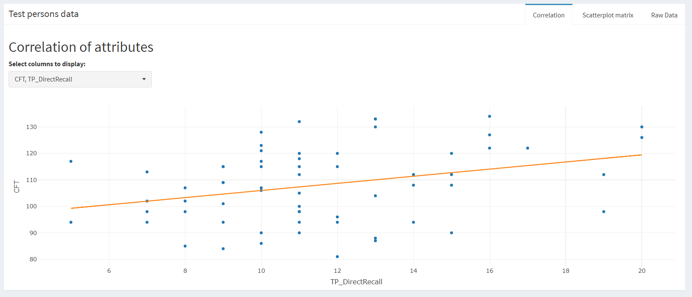

It is the task of the user to choose meaningful attributes. Nevertheless, we have found that the following variable combinations yield some linear correlation (see next XX images):
INSERT IMAGES OF CORRELATED VARIABles HERE

**Important Insights:**

* blah
* blah

Besides the option of plotting only two dependent variables, the webpage also offers the option to create a scatterplot of as many attributes as desired (See the next image). A short drawback is the problem that Shiny is not capable of rendering huge axis labels correctly which can disturb the analysis when many features are used.

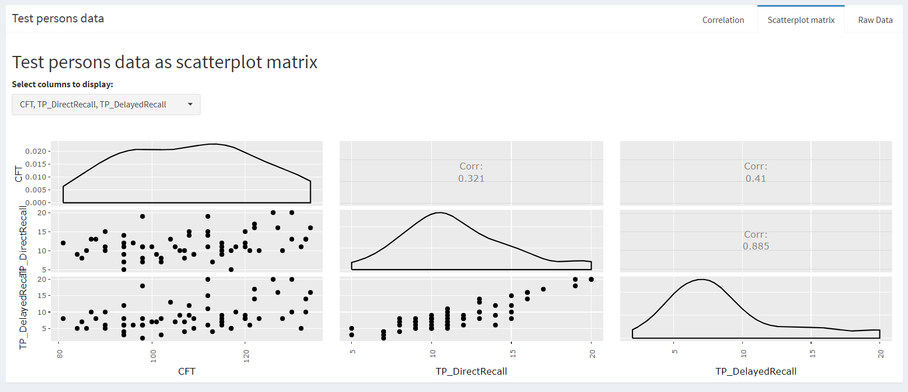

When an entry from the raw dataset tab is chosen by the user the two available trajectory files are plotted using a 3D plot in the trajectory tab (image below). Furthermore, there is a blue input that can be used to adjust which part of the trajectory is plotted (e.g. only plot the first 50 percent of the time spent in the world). The input also allows to print the "rooms" of the virtual world into the plot and to decide which z-interval is being plotted (e.g. to plot only the first floor of the buildings in the virtual world).

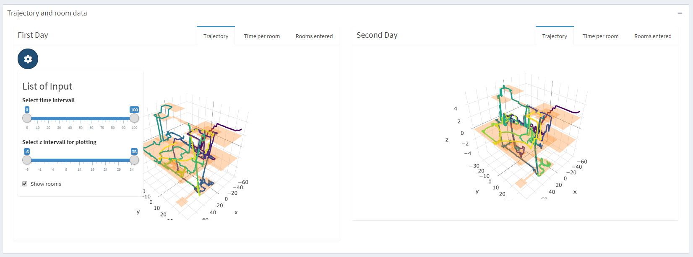

Besides the raw trajectory data, the "Time per room" and "Rooms entered" tabs allow to view more detailed information about the time the test persons spent in the virtual world. The "Time per room" tab shows the information about how much time in seconds was spent in the rooms in the world. For doing this we created an additional dataset that maps the rooms in the world to the trajectory coordinates. The "Rooms entered" tab visualizes how often a room was entered. Both graphics are plotted using bar charts. We use this information later on to build features for the trajectories.

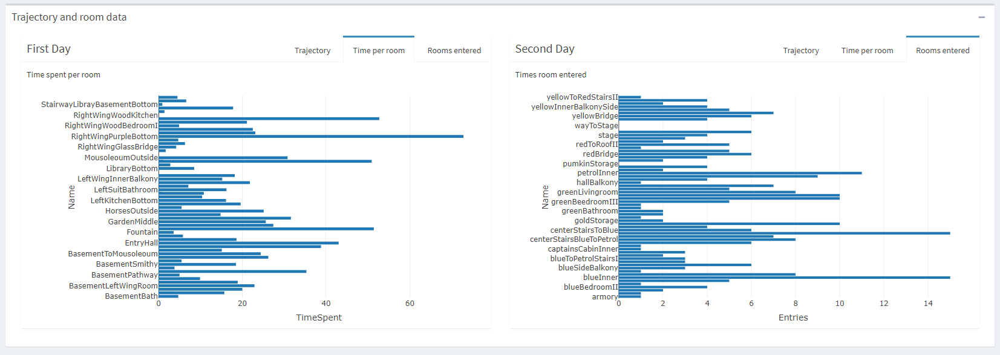

The data of the time each person has spend in the rooms of the world can be further aggregated over the two days with respect to the virtual world´s. By doing that, we can get the boxplot (image below) that shows the average time that was spent per room in each of the worlds. On the webpage, the rooms of the world are displayed when the mouse is hovered over the data points.

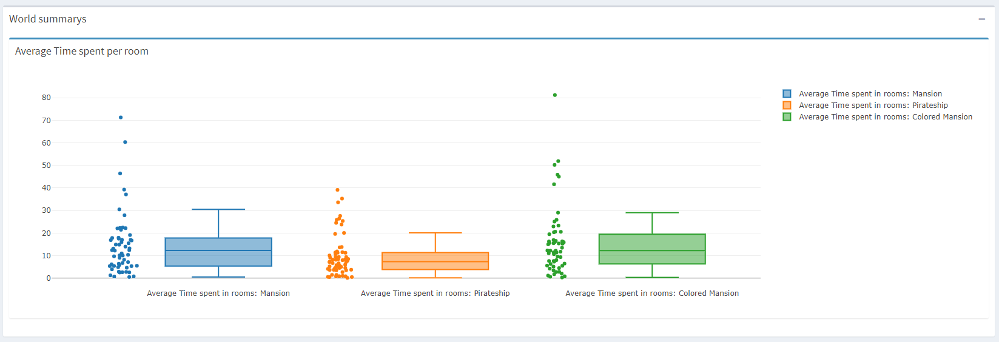

**Important Insights:**

* Some test persons where really interested in exploring the mansion
* Test persons spent less time in rooms of the pirate ship virtual world

## 4.2 Memorizing Experiment
The following charts are dealing with the analyzation of the results of the memorizing experiment. On top of the website tab the most important figures of the experiment are shown:

* Test persons had to recall 20 vocabularies
* Average direct recall was: 11.5 words
* Average delayed recall was: 8.7 words

Also, the information on the distribution of test person groups is shown there.

* Group 1: Test persons having only seen the same world twice: 39.68  %
* Group 2: Test persons having seen a new world on the second day: 41.27 %
* Group 3: Test persons having seen a partial new world on the second day: 19.05 %

Furthermore, the bar charts below those figures show the distribution of the ADHD type of the test person with respect to the three different groups.

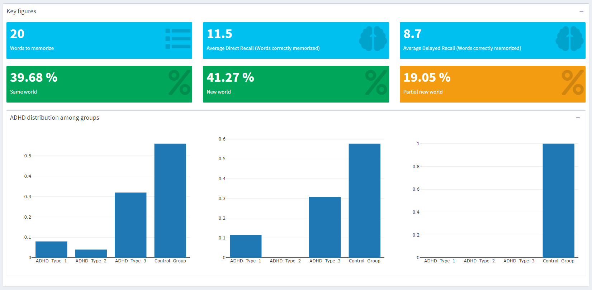

**Important Insights:**

* Fewer people in the partial new group (only 19%) compared to the other groups
* No ADHD test person in the partial new world group
* In general less ADHD test person than persons in the control group
* The TP_delayed Recall is in average 3 words less than the TP_direct Recall

The following four boxplots show the comparison of the TP_Direct_Recall and the TP_Delayed_Recall with respect to the ADHD and control group test persons.

* Group 1: Test persons having only seen the same world twice
* Group 2: Test persons having seen a new world on the second day
* Group 3: Test persons having seen a partial new world on the second day
* Group 4: Overall summary

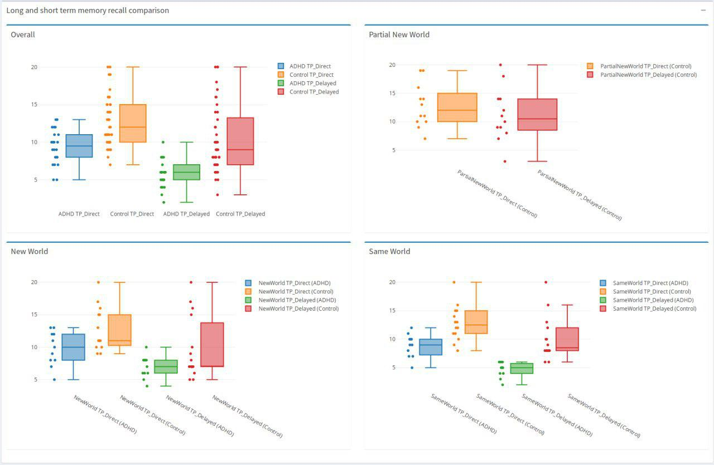

**Important Insights:**

* Non ADHD persons can memorize words better
* there are no ADHD persons in the partial new world set yet
* Persons in the control group can memorize words better than ADHD test persons (doesn´t depend on the group they have been)
* The TP_delayed recall is more closer to the TP_direct recall in the partial new group (compared to the two other groups)

## 4.3 Trajectory Features

The trajectory feature tabs shows the various features computed in 3.2.2 as boxplots with the data points jittered as done in previous visualizations.
On the very top the tab allows for the selection of up to three filters applicable to the data set prior to plotting.
Those are : Day (One or Two), World (Mansion or PirateShip) and Group (Control or ADHD)
If more then one filter is selected the filters are combined using the built in interaction function.
The two version of the Mansion are treated as the same since the geometry is identical.
The group has been collapsed into Control and ADHD since the ADHD sup types cause a splitting into unreasonable small bins.
Due to the inter activeness further filters or the selection of an attribute from persons data table for filtering can be implemented with relative ease.

All computed trajectory features are plotted into separate tabs but make use of the global filter settings for coloring.

Following an selection of some plots.

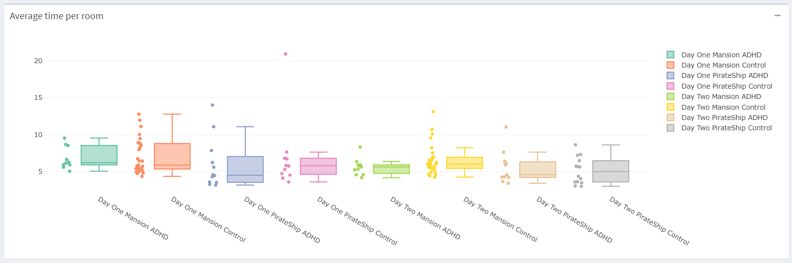

The first tab gives an overview of the average time spent per room per person in seconds.
The plot shown was made using all of the filters creating the maximum of eight bins.
It is questionable how much information can be gained by analyzing the time spent per room.

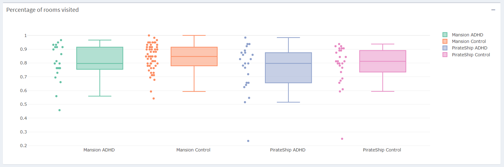

The second tab gives an overview of the fraction of rooms explored.
The number of rooms is different for each world (Mansion: 59, PirateShip: 64).
The worlds consist of several very small and hard to reach rooms like stairs making it difficult to reach a coverage close to one without extensive effort.

**Important Insights:**

* With over 50% minimum room coverage on day two this is worth mentioning taking the complex geometry and short amount of exploration time into account
* On both worlds the median coverage of rooms is higher for the control group (79.6% vs 84.6%) regardless of days

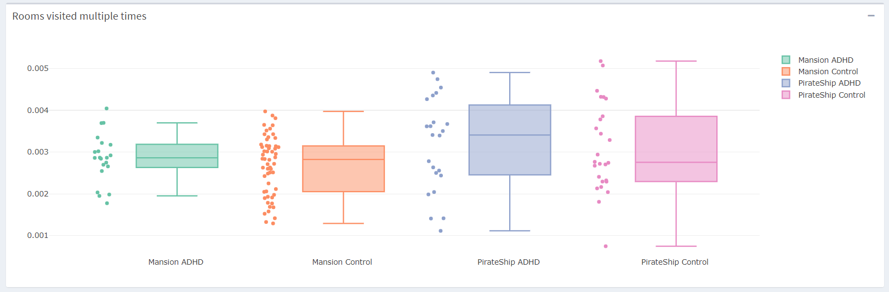

The third tab shows the number of entries of rooms regardless of time spent during the visits counting reentering. The feature is normalized using the total time spent by the test person to make it comparable to others.

**Important Insights:**

* The spread in values on the PirateShip world exceeds those of the Mansion world.
* Total minimum and maximum over all persons and worlds are both recorded in the PirateShip world.

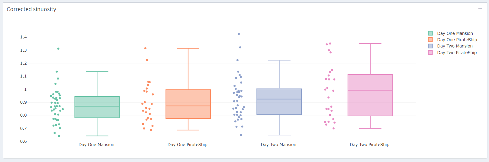

The fourth tab gives an overview of the corrected sinousity feature computed using the trajr package. The corrected version was introduced by Benhamou (2004).
It is a measurement of the straightness of the trajectory.

 **Important Insights:**

 * The median sinuosity is higher on day two regardless of the world.
 * The median sinuosity of the PirateShip is higher compared to the Mansion  both days.

The last tab gives an overview of the total time spent by the test persons in the world in minuets.
The median time spent in the world is less for the PirateShip on both days.
Fewer time was spent exploring the worlds on day two in median.
The control group spends more time median time in the worlds.

**Important Insights:**

* Over all the spread in time is larger for the control group.

# 5. Conclusions

Recapitulating this whole project, we followed the steps of a general data science project. At first, we analyzed the data we got, thought about algorithms that can be applied, cleaned and preprocessed the data, calculated features, created visualizations and finally an interactive shiny web application that offers experts the ability to analyze the data.

While implementing the application, we separated the visualizations from the underlying data such that new data can be added easily and no component in the web application needs to be changed. By separating the loading of the data, preprocessing and feature computation into several .R files that are sourced from the webpage, we also allow reusing those files independently of the webpage. This allows not only to continue developing the further analysis of the data without a shiny webpage but also to apply our functions to completely new data (like other trajectories).

Since the analysis and computation of the trajectory features, as well as the building of the shiny web application, was quite complicated our project lacks further machine learning methods. We only applied XXXXXX.
Not only due to time reasons but also because our dataset was relatively small we haven´t applied any classification techniques like decision trees, SVM´s or naive Bayes.

# 5.1 R Feedback

In the following section, we describe our experiences with the R programming language and the Shiny package.

**Advantages**:

* Allows to prototype very fast
* Offers many packages that can be used
* Nice visualizations can be created easily

**Disadvantages**:

* Steep learning curve
* Not very clear how to structure bigger R projects or especially Shiny projects (more than 2500 lines of code in our project)
* Error messages are really bad because they are in the final rendered HTML and not in the real R code
* Shiny Dashboard is not responsive in all components in every browser
* Problems when using different Shiny, R or package versions among developers

# 5.2 Final Insights
- summarize the most important insights about the dataset here!

# 5.3 Future Work

For the further development of this project, we identified the three following tasks:

* Include more data of test persons
* Use statistical tests
* Apply classification techniques to trajectory features to try to separate ADHD and non-ADHD test persons

# 6 Course Feedback

Since it is the first time this course was offered, we thought about several things that can be improved for the next course:

* Period for the project was far too short (after the proposal review meeting there were only 8 weeks with 2 weeks Christmas holiday in between)
* No really clear requirements for the final project result (maybe offer an example of how a final project should look like)
* Setup a fixed appointment after half of the project time (students can get feedback if they are working in the right direction)
* Screencast of the application doesn´t really make sense
