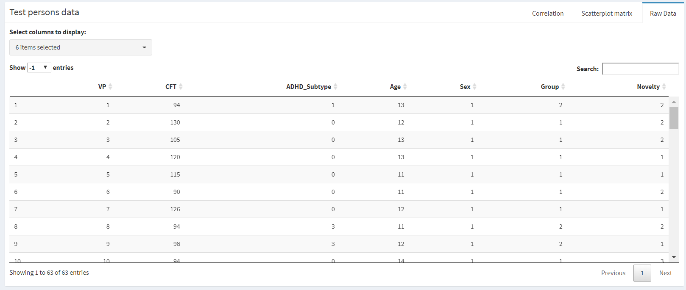
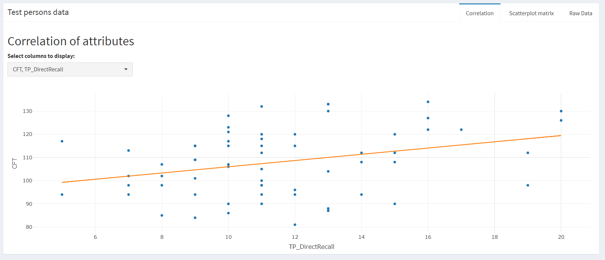
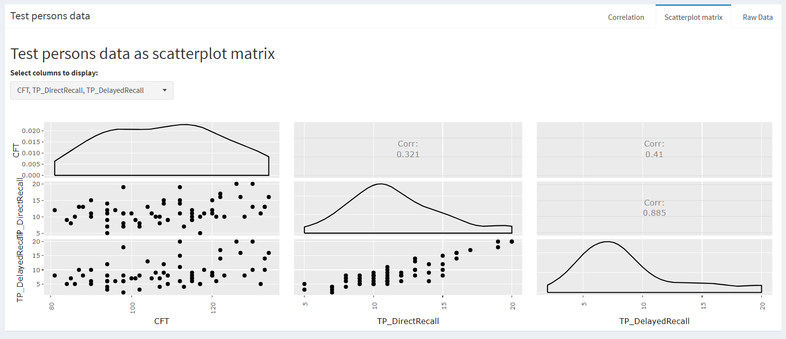
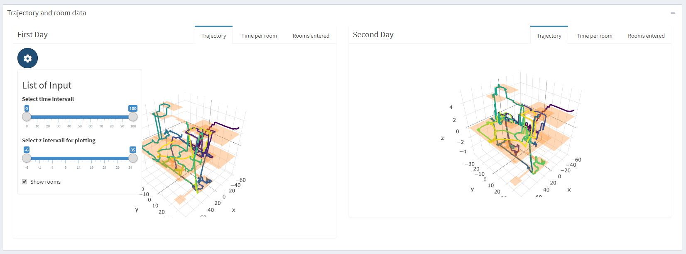
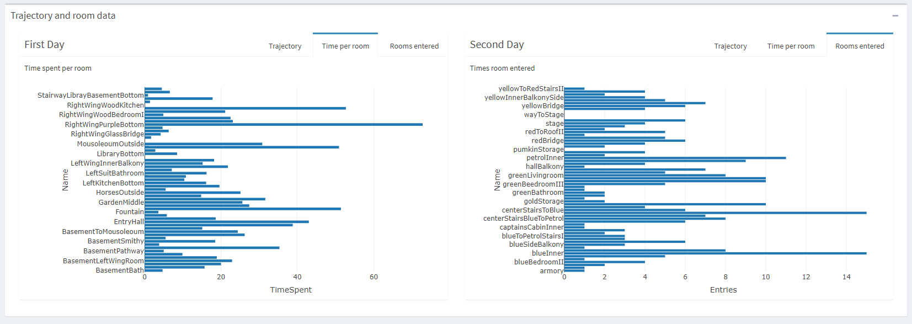
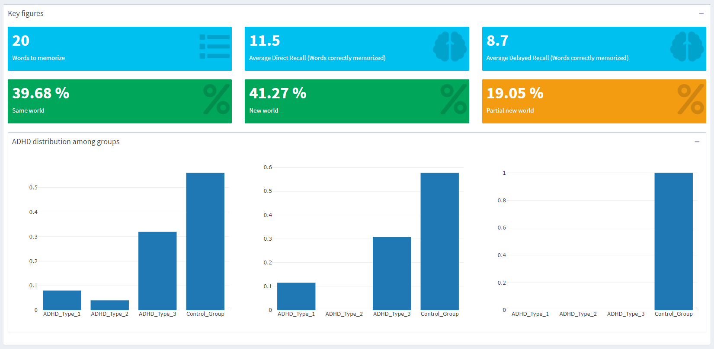
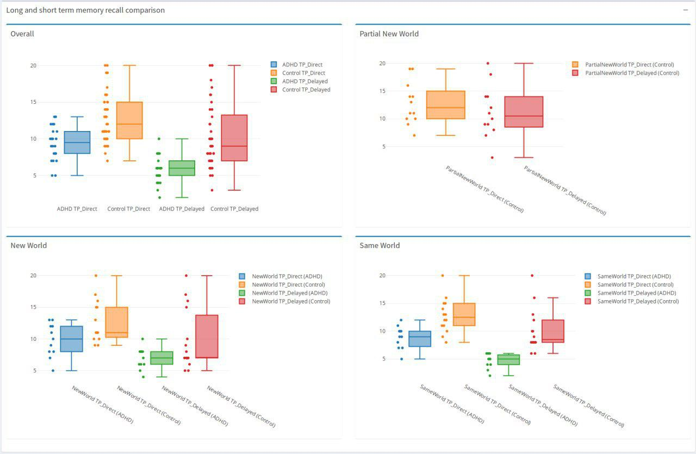

An important part of your project is your R Markdown process notebook. Your notebook details all your steps in developing your solution, including how you collected the data, alternative solutions you tried, describing machine learning algorithms/techniques you used, and the insights you got. It is strongly recommended to include many visualizations. Your process notebook should include the following topics:

Overview and motivation: overview of the project goals and the motivation for it
Related work: anything related, such as a paper, a website, a newspaper article or something else
Initial questions:
What questions are you trying to answer?
How did these questions evolve over the course of the project?
What new questions did you consider in the course of your analysis?
Data: source, scraping method, cleanup, storage, etc.
Exploratory data analysis:
What visualizations did you use to look at your data in different ways?
What are the different machine learning methods you considered?
Justify the decisions you made, and show any major changes to your ideas.
How did you reach these conclusions?
Final analysis:
What did you learn about the data?
How did you answer the questions?
How can you justify your answers?
Make sure that your process notebook is a standalone document that fully describes your process and results

# 1. Introduction

## 1.1 Overview
This markdown document is the result of the semester project of the course Data Science with R held in the winter semester 2018/2019 at the computer science faculty at the Otto-von-Guericke university Magdeburg by M.Sc. Uli Niemann from the KMD Lab. Further details regarding the lecture can be found on the official course website. This project was done as a team consisting of the members Johannes Dambacher and Alexander Wagner. The general project idea as well as an detailed time plan can be found in the project proposal. The basic idea of the course was to choose a dataset and to to gain new insights using the language R. We have decided to use a dataset from the Universitätsklinik für Psychiatrie, Psychotherapie und Psychosomatische Medizin des Kindes- und Jugendalters (KKJP) at the medical faculty of the university of Magdeburg. Further information regarding the process how the dataset was generated can be found in the dataset section. For an interactive visualization please see our Shiny website !!!LINK!!!. The whole code for this project is stored in an public GitLab Repository.

## 1.2 Repository 
GitLab Repository: https://gitlab.com/vornamenachname/datascience_r.git

## 1.3 Background and motivation
The data was recorded during a study on the impact of exploring novelty onto the learning success of children. The study group consisted of children having different types of ADHD and an control group.
For the experiment both groups (with ADHD and the control group) had to attend the study on three different days.
On the first day, the test persons got familiarized with the virtual world by spending between 10 and 20 minutes exploring one of the two worlds (see one of the worlds in the image below).
On the second day the test persons had to learn 20 new vocabularies and recall them afterwards. After the recalling the test persons had again the task to explore a virtual world for 10 to 20 minutes. The virtual world on day one and day two were the same for some test persons and different for others. On day three the vocabularies had to be recalled again by the test persons (see the process overview in the image below). Further test persons will perform the experiment in the future and thus enlarge the data set successively.

## 1.4 Dataset
The overall recorded data set consists of the trajectory data of 66 test persons in the virtual world as well as several other variables such as sex, age and others. The data set is divided into trajectory data and information of the test persons in separate csv files.
The trajectory data was retrieved by tracking the test persons movement within a 3D virtual Minecraft world. The sample rate was set to a tenth of a second. The data contains a time stamp and the x,y and z coordinate of the test persons avatar in the virtual world at a given time. Due to the software based digital tracking within a virtual world the sample points contain an exact time stamp and neither noise, nor outlier nor ambiguities or other measurement based bias.
The time spent in the virtual world should range from 10 to 20 minutes where the test persons could freely stop exploring the world after 10 minutes.
The data set of the test persons contains variables such as sex, age and others as well as the number of words remembered correctly/wrongly on the first/second day, the virtual world id for day one/two and several scores obtained using a questionnaire related to immersion, exploration behavior and similar. The full list of attributes of the used data sets are listed below.

**Summary:**

* one csv file containing the information of the test persons (66 persons)
* 130 csv files containing the trajectory information (for each person two trajectory files exist)
* **Attributes** and **features** refer to different things
* Attributes describe the test persons values such as age, sex and the scores determined using questionnaires
* Features describe the scalar representation of the trajectories computed from the trajectories using descriptor functions

### 1.4.1 Test person table

|         Attribute         |  Range  | Meaning               |
|:------------------------------:|---------|------------------|
| CFT                       |int +        |Intelligence Score         |
| ADHD_Subtype              |[0;3]        |0: Control group, 1-3 ADHD type        |
| Age                       |int +         |Age in years         |
| Sex                       |[1;2]         |Sex of the person         |
| Group                     |[1;2]         |Control, ADHD group         |
| Novelty                   |[1;3]         |Familiar/totally novel/partial novel     |
| TP_DirectRecall           |[0;20]         |Words correctly recalled after learning          |
| FP_DirectRecall           |[0;20]         |Words falsely recalled after learning         |
| TP_DelayedRecall          |[0;20]         |Words correctly recalled after delay         |
| FP_DelayedRecall          |[0;20]         |Words falsely recalled after delay         |
| Diff_Recall               |[-20;0]        |Words forgotten over time         |
| firstVR                   |[0;3]         |Virtual World ID for day one         |
| VL_Change                 |[0;1]         |         |
| Differences_PartialNew    |int +         |Detected changes in VL1.1         |
| Room_Change               |[0;1]         |Change of experiment room         |
| Gaming_Experience         |[0;3]         |Familiarity with computer games         |
| Minecraft_Familiarity     |[0;1]         |(almost 0 variance)         |
| Minecraft_Experience      |[0;3]         |(more variance compared to above)         |
| VLMT_Dg1_5                |int +         |Score in another memory test         |
| VLMT_Dg7                  |int +         |Score in another memory test         |
| VLMT_Dg5minusDg7          |int +         |Score in another memory test         |
| VLMT_W_F                  |int +         |Score in another memory test         |
| NV_total_Combined_SBB_FBB |int +         |Combined total score         |
| NV_ExErr_Combined_SBB_FBB |int +         |Explorative Excitability         |
| NV_Imp_Combined_SBB_FBB   |int +         |Impulsivity         |
| NV_total_Raw_SBB          |int +         |Total score         |
| NV_ExplErr_Raw_SBB        |int +         |Explorative Excitability         |
| NV_Impulsivität_Raw_SBB   |int +         |Impulsivity         |
| VE_Day2                   |[0;3]         |Virtual World ID for day two         |
| Exclusion_Position_Data   |1,777,999         |Error status for trajectory logging         |

### 1.4.2 Trajectory Table

There should be two trajectory files for each person.

| Attribute | Meaning |
|:-----------:|---------|
| time      |time stamp in milliseconds    |
| x         |x-coordinate minecraft world  |
| z         |z-coordinate minecraft world  |
| y         |y-coordinate minecraft world  |

# 2. Concept

The following chapter contains the general ideas that were written down in the project proposal in the beginning of the project.

## 2.1 Objectives

We are trying to explore and answer the following questions:

* Which features can be created from the trajectory data?
* Can test persons not having ADHD memorize words better than persons having ADHD?
* What is the impact of the novelty of the virtual world on the learning success on day two (How did the number of remembered words change depending whether the test persons have seen an old or a new world before memorizing the vocabularies? Is there a difference for ADHD and non-ADHD persons?)
* What is the impact of the **novelty** and the **exploitative excitability** scores (On the learning success? On the exploration of the virtual world (e.g. duration)? On the trajectory?)
* Can the ADHD type be predicted from the trajectory data (features)?
* Which interactive visualization can be created for the data set?

## 2.2 Relevant Papers

## 2.3 Possible problems
* Only a small data set yet (can be hard to proof statistical significance)
* Some trajectory data sets can not be used completely because there was an error in the recording process or the test person stopped exploring the world earlier than expected
* Little comparable work on the feature extraction from trajectories
* Little comparable work on the comparison of trajectories

## 2.4 Design overview
The design consists mainly of two parts:

1. Data analysis and 
2. (interactive) visualization

For the first part we will make use of algorithms and packages specialized for trajectory data, clustering and correlation analysis as well as regression fitting.
An important role is the extraction of features from the trajectory data. Since there is not much related work available, this task contains defining, testing and implementing possible features such as:

* Time spent per room 
* Time spent inside or outside house 
* Overall time spent in the world
* Repeated visit of same the place/room
* Steadiness vs roughness of motion
* Spectral features derived using fast Fourier transform

For the feature description the trajectory data (given in euclidian coordinates) has to be converted to a graph like representation that is listing the order and time spent in the rooms of the virtual world.
After the derivation of the trajectory features those will be used to predict or correlate to the test persons attributes retrieved by questionnaires. This tasks makes particular use of clustering algorithms.

The goal of the visual design is the interactive visualization of the data set itself and the analysis results of the data set.
To complete this task we will make use of the shiny library as much as possible with respect to the analysis of trajectory data.
The trajectory data will be visualized using 3D scatter plots. We will provide a visual comparison method of several trajectories from different test persons. We seek an embedding of the architecture of the virtual world into the scatter plot visualization.
The retrieved trajectory features will be represented in table form together with the test persons attributes to provide an detailed overview.
The table data will be displayed separately using a scatter plot matrix to allow analysis of correspondence and variance of the data. The scatter plot matrix will provide filter for splitting the data into groups (e.g. only test persons with ADHD).

# 3. Implementation
The ideas and results of the concept implementation will be de detailed in the following chapter.

## 3.1. Packages
We use the following R packages for the implementation:

* pracma
* tibble
* shinydashboard
* shinyWidgets
* data.table
* ggplot2
* plotly
* dtplyr
* readxl
* stringr
* DT
* crosstalk
* GGally
* reader
* plyr

## 3.2 Data
As already written in the concept section, the dataset consists of two kinds of files. The person data and the trajectory data. The person data contains information about the test persons and has several NAN´s or missing values. Furthermore it has a column which indicates that the corresponding trajectory file is maybe not complete. The section 3.1.1 discuss how we load and store the data while section 3.1.2 describes how we deal with the missing values

### 3.2.1 Data structure
- Describe how we load the data here
- how we are accessing it
- precalculating of room graph

### 3.2.2 Data preprocessing
- remove entries with NAN´s
- rmeove entries with missing values
-

## 3.3 Algorithms and Methods

### 3.3.1 Machine Learning
- Linear Regression
- Clustering

### 3.3.2 Visualization
- bar charts
- Tables
- Scatterplot
- 3D-Plots + Rooms (trajectory plots)
- Boxplots

# 4. Results

- Explore the raw data table

- try to find linear correlation

- see the correlation of diffrerent attributes

- visualize the trajectories and room summarys for different persons

-overview on the visited rooms

- visualize the diffrent groups of patients

- viualize memorizing results

# 5. Conclusion

