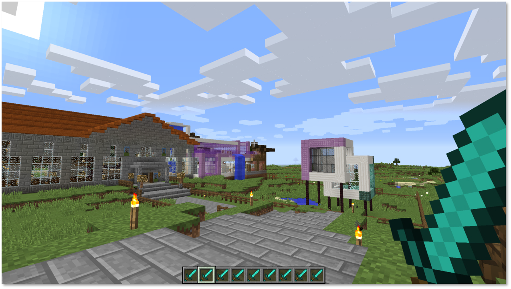
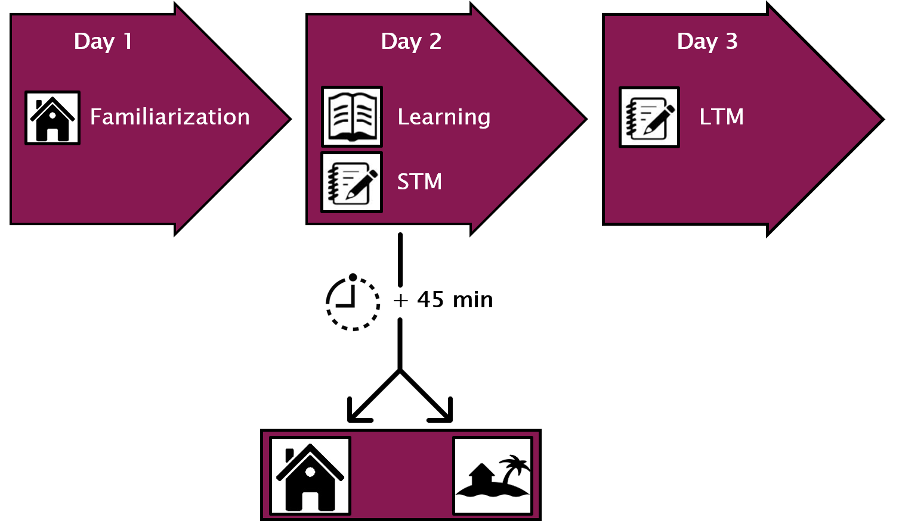

```{r setup, include=FALSE}
knitr::opts_chunk$set(echo = TRUE)
```

# Project title
Analysis of trajectory data of human movement in an virtual environment with relation to short and long term memory experiments.


# Overview
This project aims to study and analyze a data set using R and to interactively visualize the results to allow scientists to explore the data set on their own.
The data set used in this project contains experimental test data from studies about human learning and exploitative behavior of humans.
Within this project various statistical techniques such as clustering and classification, regression and correlation analysis, decision trees and other have to be freely tested on the data set to retrieve new information and to gain insight.


# Team
The team consists of two master students, namely:

1. Johannes Dambacher (206495)
2. Alexander Wagner (217884)

# Repository 
GitLab Repository: https://gitlab.com/vornamenachname/datascience_r.git

# Background and motivation

The data was recorded during a study on the impact of exploring novelty onto the learning success of children. The study group consists of children having different types of ADHD and an control group.
For the experiment both test groups (with ADHD and the control group) had to attend the study on three different days.
On the first day the test persons got familiarized with the virtual world by spending between 10 and 20 minutes exploring one of two worlds (see one of the worlds in the image below).
On the second day the test persons had to learn 20 new vocabularies and recall them afterwards. After the recalling the test persons had again to explore a virtual world for 10 to 20 minutes. The virtual worlds on day one and two were the same for some test persons and different for others. On day three the vocabularies had to be recalled by the test persons (see the process overview in the image below). 

Further test persons will perform the experiment in the future and thus enlarge the data set successive.



\newpage

# Dataset

The overall recorded data set consists of the trajectory data of the 66 test persons in the virtual world as well as several other variables such as sex, age and others. The data set is divided into trajectory data and information about the test persons in separte csv files.
The trajectory data was retrieved by tracking the test persons movement within a 3D virtual Minecraft world. The sample rate was set to a tenth of a second. The data contains a time stamp and the x,y and z coordinate of the test persons avatar in the virtual world at a given time. Due to the software based digital tracking within a virtual world the sample points contain an exact time stamp and neither noise, nor outlier nor ambiguities or other measurement based bias.
The time spent in the virtual world should range from 10 to 20 minutes where the test persons could freely stop exploring the world after 10 minutes.
The data set of the test persons contains variables such as sex, age and others as well as the number of words remembered correctly/wrongly on the first/second day, the virtual world id for day one/two and several scores obtained using a questionnaire related to immersion, exploration behavior and similar. The full list of attributes of the used data sets are listed below.

**Summary:**

* one csv file containing the information of the test persons (XX persons)
* 130 csv files containing the trajectory information (for each person two trajectory files exist)


## Test person table

|         Attribute         |  Range  | Meaning |
|:-------------------------:|---------|---------|
| CFT                       |int +        |Intelligence Score         |
| ADHD_Subtype              |[0;3]        |0: Control group, 1-3 ADHD type        |
| Age                       |int +         |Age in years         |
| Sex                       |[1;2]         |         |
| Group                     |[1;2]         |Control, ADHD group         |
| Novelty                   |[0;3]         |Familiar/totally novel/partial novel     |
| TP_DirectRecall           |[0;20]         |Words correctly recalled after learning          |
| FP_DirectRecall           |[0;20]         |Words falsely recalled after learning         |
| TP_DelayedRecall          |[0;20]         |Words correctly recalled after delay         |
| FP_DelayedRecall          |[0;20]         |Words falsely recalled after delay         |
| Diff_Recall               |[-20;0]        |Words forgotten over time         |
| firstVR                   |[0;3]         |Virtual World ID for day one         |
| VL_Change                 |[0;1]         |         |
| Differences_PartialNew    |int +         |Detected changes in VL1.1         |
| Room_Change               |[0;1]         |Change of experiment room         |
| Gaming_Experience         |[0;3]         |Familiarity with computer games         |
| Minecraft_Familiarity     |[0;1]         |(almost 0 variance)         |
| Minecraft_Experience      |[0;3]         |(more variance compared to above)         |
| VLMT_Dg1_5                |int +         |Score in another memory test         |
| VLMT_Dg7                  |int +         |Score in another memory test         |
| VLMT_Dg5minusDg7          |int +         |Score in another memory test         |
| VLMT_W_F                  |int +         |Score in another memory test         |
| NV_total_Combined_SBB_FBB |int +         |Combined total score         |
| NV_ExErr_Combined_SBB_FBB |int +         |Explorative Excitability         |
| NV_Imp_Combined_SBB_FBB   |int +         |Impulsivity         |
| NV_total_Raw_SBB          |int +         |Total score         |
| NV_ExplErr_Raw_SBB        |int +         |Explorative Excitability         |
| NV_Impulsivität_Raw_SBB   |int +         |Impulsivity         |
| VE_Day2                   |[0;3]         |Virtual World ID for day two         |
| Exclusion_Position_Data   |1,777,999         |Error status for trajectory logging         |


## Trajectory Table

| Attribute | Meaning |
|-----------|---------|
| time      |time stamp in milliseconds    |
| x         |x-coordinate minecraft world  |
| z         |z-coordinate minecraft world  |
| y         |y-coordinate minecraft world  |


# Objectives

We are trying to explore and answer the following questions:

* Which features can be created from the trajectory data?
* Can test persons not having ADHD memorize words better than persons having ADHD?
* What is the impact of the novelty of the virtual world on the learning success on day two
  + How did the number of remembered words change depending wether the test persons have seen an old or a new world before memorizing the vocabularies?
  + Is there a difference for ADHD and non-ADHD persons?
* What is the impact of the **novelty** and the **exploitative excitability** scores:
  + on the learning success?
  + on the exploration of the virtual world (e.g. duration)?
  + on the trajectory?
  
* Can the ADHD type be predicted from the trajectory data (features)?


* Which interactive visualization can be created for the dataset?


# Possible problems:
* Only a small dataset yet (can be hard to proof statistical significance)
* Some trajectory datasets can not be used completely because there was an error in the recording process or the test person stopped exploring the world earlier than expected
* Little comparable work on the feature extraction from trajectories
* Little comparable work on the comparison of trajectories


# Design overview
The design consists mainly of two parts:

1. Data analysis and 
2. (interactive) visualisation

For the first part we will make use of algorithms and packages specialized for trajectory data, clustering and correspondence analysis as well as regression fitting.
An important role is the extraction of features from the trajectory data. Since there is not much related work available, this task contains defining, testing and implementing possible features such as:

* time spent per room 
* time spent inside or outside house 
* overall time spent in the world
* repeated visit of same the place/room
* steadiness vs roughness of motion
* spectral features derived using fft

For the feature description using the architecture of the virtual world (rooms etc.) a conversion from trajectory data with respect to an euclidean coordinate space must be converted to a graph like representation listing the order and time spent in rooms.
After the derivation of trajectories features those will be used to predict or correlate to the test persons attributes retrieved by questionnaires.
This tasks makes particular use of clustering algorithms and similar techniques guided by the following thoughts:

* Clustering algorithm
* Clustering into exploitative behavior 

The goal of the visual design is the interactive visualisation of the data set itself and the analysis resluts of the data set.
To complete this task we will make use of the shiny library as much as possible with respect to the analysis of trajectory data.
The trajectory date will be visualize using 3D scatter plots. We will provide a visual comparison method of several trajectories from different test persons. We seek an embedding of the architecture of the virtual world into the scatterplot visualisation.
The retrieved trajectory features will be represented in tabel form together with the test persons attributes to provide an detailde overview.
The table data will seperatly be displayed using a scatter plot matrix to allow analysis of correspondence an variance of the data. For the scatter polt matrix a way to filter groups (e.g. only test persons with ADHD) will be provided.


# Project plan ()

|       Week      |        Task        | Subtasks | Responsible |
|:---------------:|:------------------:|-----------|:-----------:|
| 19.11. - 25.11. |data loading |functions for loading the csv files           |             |
|                 |data preprocessing |removing NaN values           |             |
|                 | |exclude broken data entries           |             |
| 26.11. - 02.12. |feature extraction  |           |             |
| 03.12. - 09.12. |                    |           |             |
| 10.12. - 16.12. |                    |           |             |
| 17.12. - 23.12. | visualization        |           |             |
| 24.12. - 30.12. | holiday            |           |             |
| 31.12. - 06.01. | website creation    |           |             |
| 07.01. - 13.01. | final correction    |           |             |
|                 | Submission         |           |             |
| 25.01.          | Final Presentation |           |             |


